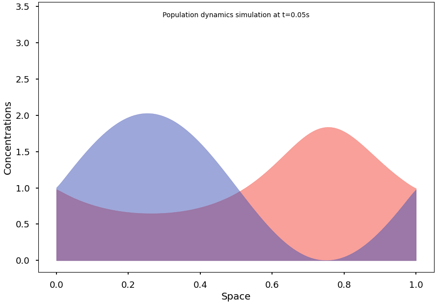

# PySpecies

Blazing-fast simulation of advanced 1D population dynamics.

Based on the Shigesada Kawasaki Teramoto (SKT) reaction-diffusion model. [[PubMed '79]](https://pubmed.ncbi.nlm.nih.gov/513804/)



## Installation

```bash
pip install pyspecies
```

## Usage

For example, the following code computes a solution of the SKT model and converges to a non-homogeneous steady state:

```python
import numpy as np

from pyspecies import models, pop

# Define population and interaction model
q = pop.Pop(
    space=(0, 1, 200),
    u0=lambda x: 1 + np.cos(2 * np.pi * x),
    v0=lambda x: 1 + np.sin(2 * np.pi * x),
    model=models.SKT(
        D=np.array([[5e-3, 0, 3], [5e-3, 0, 0]]),
        R=np.array([[5, 3, 1], [2, 1, 3]])
    ),
)

# Simulate with increasing speeds
for i in range(-2, 2):
    q.sim(duration=2*10**i, N=100)

# Animate the result
q.anim()

# Show the evolution of the population over space and time
# q.heatmap()

# Show the final state of the population (100%)
# q.snapshot(1)
```

This code displays a cyclic, homogenous solution of the Lotka-Volterra equations:

```python
p = pop.Pop(
    space = (0, 1, 10),
    u0 = lambda x: 1 + 0*x,  # IC for prey
    v0 = lambda x: 1 + 0*x,  # IC for predator
    model = models.LV(1.1, 0.4, 0.4, 0.1)
)

p.sim(duration=20, N=200)
p.sim(duration=100, N=200)
p.anim()
```

## Theory

The calculations underlying this library are described (in French) in the following document: [Théorie](./misc/theory.pdf).